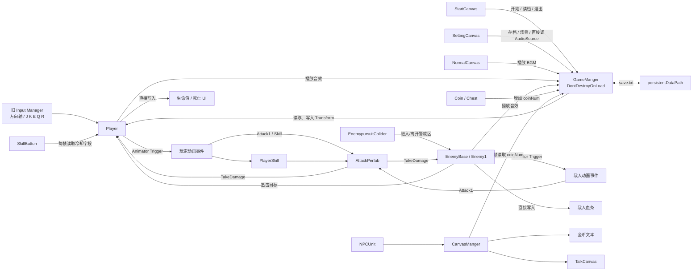

# TinySword

TinySword 是一个使用 Unity 6 制作的 2D 俯视角动作角色扮演游戏原型。项目包含主菜单、玩家战斗、敌人状态机、技能冷却、NPC 对话、宝箱与金币、音量设置、存档读取和死亡重开等基础功能，适合用于学习小型 Unity 2D ARPG 的完整玩法链路。

## 系统架构图



## 开发环境

| 项目 | 配置 |
| --- | --- |
| Unity 版本 | Unity 6000.0.47f1 |
| 项目类型 | 2D |
| 渲染色彩空间 | Linear |
| UI 系统 | uGUI（Legacy Text、Slider） |
| 输入系统 | 旧版 Input Manager |
| 默认分辨率 | 1920 × 1080 |
| Android 脚本后端 | IL2CPP |

建议使用项目记录的 Unity 版本打开。使用其他 Unity 6 版本前，请先备份项目并留意资源重新导入及序列化差异。

## 已实现功能

- 开始游戏、读取存档和退出游戏
- 玩家八方向移动
- 两段普通攻击
- 正面格挡与格挡冷却
- 三个主动技能及冷却显示
- 玩家生命值、受伤、死亡和重新开始
- 敌人巡逻、待机、追击、攻击、受击和死亡状态
- 敌人死亡掉落金币
- NPC 自动触发对话
- 宝箱开启与金币奖励
- 植物遮挡时半透明显示
- 音效和背景音乐音量调节
- 玩家位置与金币数量的本地存档

## 快速开始

1. 使用 Unity Hub 添加并打开项目根目录。
2. 确认编辑器版本为 Unity `6000.0.47f1`。
3. 打开 `Assets/Scenes/StartScene.unity`。
4. 点击 Unity 编辑器顶部的 Play 按钮。

构建前请确认 Build Profiles/Build Settings 中包含并启用了以下场景：

1. `Assets/Scenes/StartScene.unity`
2. `Assets/Scenes/GameScene.unity`

## 操作方式

| 操作 | 按键 |
| --- | --- |
| 移动 | `W` `A` `S` `D` 或方向键 |
| 普通攻击 | `J` |
| 开启/取消格挡 | `K` |
| 技能 1 | `E` |
| 技能 2 | `Q` |
| 技能 3 | `R` |

格挡只能防御角色当前朝向一侧的攻击，并受独立冷却时间限制。

## 游戏流程

```text
StartScene
  ├─ 开始游戏 ──────────> GameScene
  ├─ 读取存档 ──────────> GameScene + 恢复位置/金币
  └─ 退出游戏

GameScene
  ├─ 探索地图、与 NPC 对话
  ├─ 战斗、使用技能、击败敌人
  ├─ 开启宝箱、收集金币
  ├─ 设置音量、保存游戏
  └─ 玩家死亡后重新加载 GameScene
```

## 场景说明

### StartScene

游戏入口场景，包含开始、读取存档、退出按钮以及全局 `GameManger` 预制体。进入场景后播放主菜单背景音乐。

### GameScene

主游戏场景，包含：

- 1 个玩家
- 9 个敌人实例
- NPC、宝箱和金币交互
- 地形、建筑、植物和碰撞区域
- 普通界面、技能界面、设置界面、对话界面和死亡界面

敌人 2、敌人 3 和 Boss 基于敌人 1 预制体制作，共用 `EnemyBase` 状态机。

## 代码结构

业务脚本位于 `Assets/Scripts`。

| 脚本 | 职责 |
| --- | --- |
| `GameManger.cs` | 全局单例、场景切换、音频、金币和存档 |
| `Player.cs` | 移动、攻击、格挡、技能、受伤和死亡 |
| `PlayerSkill.cs` | 技能特效生成攻击判定体 |
| `AttackPerfab.cs` | 玩家与敌人共用的伤害触发器 |
| `EnemyBase.cs` | 敌人状态机、移动、攻击、受伤、死亡和掉落 |
| `Enemy1.cs` | 当前敌人基础类型 |
| `EnemypursuitColider.cs` | 敌人警戒范围检测 |
| `CanvasManger.cs` | 游戏场景 UI 面板管理及金币显示 |
| `StartCanvas.cs` | 主菜单按钮事件 |
| `NormalCanvas.cs` | 游戏主界面及背景音乐入口 |
| `SettingCanvas.cs` | 音量、保存和返回主菜单 |
| `TalkCanvas.cs` | NPC 与玩家的交替对话 |
| `SkillButton.cs` | 技能和格挡冷却显示 |
| `DeadUI.cs` | 死亡后重新开始 |
| `NPCUnit.cs` | NPC 对话触发区域 |
| `Chest.cs` | 宝箱开启和金币生成 |
| `Coin.cs` | 金币拾取 |
| `Plants.cs` | 玩家进入遮挡区域后的透明效果 |

### 核心调用关系

```text
Player / EnemyBase
        │
        ├─ 动画事件生成 AttackPerfab
        │                 │
        │                 ├─ 命中 EnemyBase.TakeDamage()
        │                 └─ 命中 Player.TakeDamage()
        │
        ├─ GameManger 播放音效、管理金币
        └─ CanvasManger / SkillButton 更新 UI
```

### 敌人状态机

```text
walk <──> idle
  │
  └──> pursuit <──> attack
          │            │
          └──> getHit <─┘
                 │
                 └──> dead
```

敌人通常在两个巡逻点之间移动；玩家进入警戒触发器后成为追击目标，进入攻击距离后发动攻击。敌人死亡时销毁所属预制体并生成金币。

## 目录结构

```text
Tiny_Swords/
├─ Assets/
│  ├─ Anims/                         # 玩家、敌人及场景动画
│  ├─ Pixel Art/                     # 像素特效资源
│  ├─ Prefabs/
│  │  ├─ Terrain/                    # 地形和装饰预制体
│  │  ├─ UI/                         # UI 与全局管理器预制体
│  │  ├─ Unit/                       # 玩家、敌人、金币和攻击体
│  │  └─ VFX/                        # 玩家技能特效
│  ├─ Scenes/                        # StartScene、GameScene
│  ├─ Scripts/                       # 项目业务脚本
│  ├─ Tiny Swords/                   # Tiny Swords 美术资源
│  └─ Tiny Swords (Enemy Pack)/      # 敌人美术资源
├─ Packages/                         # Unity Package Manager 配置
└─ ProjectSettings/                  # Unity 项目设置
```

`Library`、`Temp`、`Logs`、`obj` 和 `.vs` 均为本地生成目录，不应作为项目源文件进行维护。

## 存档说明

存档文件名为 `save.txt`，实际位置由 `Application.persistentDataPath` 决定。Windows 平台通常位于：

```text
%USERPROFILE%\AppData\LocalLow\DefaultCompany\TinySword\save.txt
```

当前存档使用逗号分隔的纯文本格式：

```text
玩家X坐标,玩家Y坐标,玩家Z坐标,金币数量
```

当前只保存玩家位置和金币数量，不保存以下状态：

- 玩家生命值和技能冷却
- 已击败的敌人
- 已开启的宝箱
- 对话进度
- 音量设置

## 音频配置

`GameManger` 预制体配置了 6 个战斗/交互音效和 2 个背景音乐。脚本通过数组下标播放音频，因此调整数组顺序时需要同步检查代码中的音频编号。

## 第三方资源

项目包含以下美术资源目录：

- `Assets/Tiny Swords`
- `Assets/Tiny Swords (Enemy Pack)`
- `Assets/Pixel Art/PixelArtRPGVFXLite`

发布或再分发项目前，请根据各资源包原始来源确认对应授权条款。仓库内资源目录不等同于授权证明。

## 已知限制

- 玩家死亡后，输入逻辑仍可能触发攻击或技能。
- 设置界面和对话界面打开时没有暂停玩家控制。
- 开始新游戏时，全局管理器中的金币不会主动恢复初始值。
- 存档缺少格式校验，存档损坏可能导致读取异常。
- 存档中的浮点数受系统区域格式影响，不适合作为长期或跨平台格式。
- Boss 当前复用普通敌人的战斗逻辑和基础属性，没有专属阶段或技能。
- 攻击体和技能频繁使用 `Instantiate`/`Destroy`，大量单位同时战斗时可考虑对象池。
- 项目暂未包含自动化测试、程序集拆分和统一的数据配置系统。

## 后续开发建议

1. 为死亡、设置和对话增加统一的输入锁定或游戏状态管理。
2. 区分“新游戏”和“继续游戏”，并明确重置全局运行数据。
3. 将存档改为带版本号的 JSON 数据，并增加异常处理。
4. 使用 ScriptableObject 管理玩家、敌人、技能和音频配置。
5. 为 Boss 增加独立属性、技能和阶段状态。
6. 将频繁生成的攻击体、技能特效和金币改为对象池。
7. 补充 Play Mode 测试、版本控制忽略规则和发布说明。

## 注意事项

- 当前代码依赖旧版 Input Manager；切换到新输入系统前需要同步改造 `Player` 输入逻辑。
- 多个组件依赖 Inspector 引用。修改预制体或场景层级后，应检查字段是否仍正确绑定。
- `GameManger` 使用 `DontDestroyOnLoad` 跨场景保留；场景中的重复实例会在运行时被销毁。
- 场景名、标签和部分配置使用字符串或数组下标引用，重命名时需要同步检查调用处。

