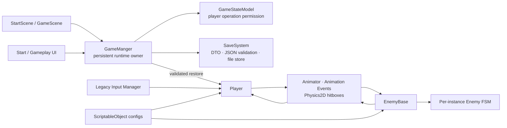

# TinySword-Enhanced

> 一款由开发者独立构建，并通过渐进式架构重构持续演进的 Unity 2D 俯视角 ARPG。

## 项目概览

TinySword 是一款用 Unity `6000.0.47f1` 开发的小型 2D top-down ARPG。本人首先完成了完整可玩的 Gameplay baseline，负责 Gameplay design 与 implementation，包括玩家移动与战斗、Enemy behavior、NPC dialogue、交互、UI、音频以及本地 Save / Continue 流程。

在基础 Gameplay 完成后，我继续将项目演进为包含 architecture evolution、regression testing 和 documentation 的工程化作品集。在保留既有 Gameplay、Unity Serialized References 和 Animation Event contracts 的前提下，项目逐步引入 centralized GameState、data-driven configuration、分层 Persistence 和可测试的 Enemy FSM。

Codex / ChatGPT 是后续工程演进中的辅助工具，而不是 TinySword 原始项目或 Gameplay 的作者。AI-assisted workflow 受 Human Review 控制；原始游戏开发、Gameplay design / implementation、Scope、架构取舍、实施批准、Unity validation 和 merge decision 均由我负责。

## 游戏玩法功能

- 八方向移动与 two-hit normal attack combo
- 正面 Guard 与独立 cooldown
- 三个 active skills 与 cooldown display
- Enemy 巡逻、追击、攻击、受击、死亡与 coin drop
- NPC dialogue、Chest / Coin interaction
- Settings / Dead UI、BGM / SFX
- New Game、Save 与 Continue

## 工程化亮点

### GameState & Player Operation Locking（游戏状态与玩家操作锁定）

`GameManger` 持有集中的 `GameStateModel`，明确区分 `Playing`、`Dialogue`、`Settings` 和 `Dead`。Dialogue 与 Settings 互斥，Dead 在当前模型生命周期中保持 terminal；Player 通过统一 permission boundary 决定是否接受操作。该机制锁定 Player operation，但不会暂停整个游戏世界。

### Versioned SaveSystem（版本化存档系统）

旧 CSV persistence 已重构为 versioned JSON SaveSystem，并分为 `SaveData`、`SaveJsonCodec`、`SaveFileStore` 和 Scene restore integration。Continue 在加载 GameScene 前完成读取和 Validation；New Game 清除 pending restore 并重置全局 coin。只有通过完整验证且 Player readiness 满足时，position 与 coin 才会一起恢复，避免 partial restore。

### ScriptableObject Configuration（ScriptableObject 配置）

`PlayerConfig`、`SkillConfig` 和 `EnemyConfig` 将 shared tuning data 从 MonoBehaviour 中分离。Config 作为共享、只读的调参来源；HP、cooldown、target、FSM state 等 mutable gameplay state 继续由各 runtime instance 持有。

### Enemy FSM Refactor（敌人有限状态机重构）

Enemy FSM 由 lightweight pure C# Core 和 `idle`、`walk`、`pursuit`、`attack`、`getHit`、`dead` 六个 concrete behaviours 组成。每个 Enemy instance 独立持有 FSM 与状态对象，支持 same-state re-entry，并在状态退出时清理相关 delayed callbacks。该重构通过 behavior-preserving integration 保留既有 Prefab、Serialized Fields 和 Animation Event contracts。

### Validation Strategy（验证策略）

纯逻辑边界通过独立 Edit Mode test assemblies 覆盖；Scene、Animator、Physics2D 和 UI 等 Unity-dependent behavior 被划入 targeted Play Mode validation 边界。自动化测试、Unity runtime validation 与 Human / PR Review 共同构成验证策略。

## 架构概览

`GameManger` 是 persistent runtime owner；Player、Enemy 和 UI 仍属于 Scene lifecycle。ScriptableObject 提供 shared tuning data，mutable gameplay state 保持在 runtime instances 中。

完整的 runtime ownership、Scene lifecycle 和系统边界见 [Architecture](docs/architecture.md)。

## 验证

The repository contains **91 expanded Edit Mode test cases**：

| Suite | Cases |
| --- | ---: |
| GameState | 27 |
| SaveSystem | 56 |
| EnemyFSM | 8 |
| **Total** | **91** |

该数字描述当前 repository 中的测试清单；本次 README 更新没有重新运行全部 Unity Test Runner，因此不将其表述为当前 revision 的通过结果。

对于 Unity-dependent behavior，验证策略采用 targeted Play Mode checklist，范围包括 Scene lifecycle、`DontDestroyOnLoad`、Animator / Animation Events、Physics2D、Player operation locking、serialized references、UI、audio，以及 Save / Continue integration。本次 README revision 没有重新执行这些 runtime checks。

## AI 辅助开发

`Issue / Analysis → Architecture Proposal → Human Review → Explicit Approval → Implementation → Automated Tests → Unity Validation → PR`

这套 AI-assisted workflow 主要用于 Gameplay baseline 完成后的工程演进。Codex / ChatGPT 参与 repository inspection、Architecture Proposal、获批范围内的 implementation、regression-test development 和 review assistance；Developer 负责原始游戏开发、Gameplay design / implementation、Scope、architecture acceptance / rejection、implementation approval、test interpretation、Unity runtime validation 与 merge decision。

详细过程与证据边界见 [AI-Assisted SaveSystem Case Study](docs/ai-assisted-development.md)。

## 文档

### 架构

[TinySword Architecture](docs/architecture.md) 说明 current runtime ownership、Scene lifecycle、GameState、Combat、Config、Enemy FSM、SaveSystem 和 validation boundary。

### AI 辅助 SaveSystem 案例研究

[AI-Assisted Development under Human Review](docs/ai-assisted-development.md) 记录 Human Review、Scope control、failed-test feedback、architecture correction 和 validation evidence。

## 技术栈

| 类别 | 技术 |
| --- | --- |
| 游戏引擎 | Unity `6000.0.47f1` |
| 编程语言 | C# |
| 用户界面 | UGUI |
| 输入系统 | Legacy Input Manager |
| 配置方式 | ScriptableObject |
| 游戏运行时 | Physics2D、Animator、Animation Event |
| 测试 | NUnit、Unity Test Framework |

## 本地运行

1. Clone 或下载 repository。
2. 使用 Unity Hub 和 Unity `6000.0.47f1` 打开项目根目录。
3. 打开 `Assets/Scenes/StartScene.unity`。
4. 进入 Play Mode。

如需检查自动化测试，在 Unity Test Runner 中运行 Edit Mode suites。

## 操作方式

| Action | Input |
| --- | --- |
| Movement | `W` `A` `S` `D` 或方向键 |
| Normal attack | `J` |
| Guard | `K` |
| Skill 1 | `E` |
| Skill 2 | `Q` |
| Skill 3 | `R` |

## 第三方资源与范围说明

The project uses third-party art / VFX assets for gameplay presentation. These assets are not part of my original work.

当前 SaveSystem 只保存 Player position 和 coin count，不覆盖 Enemy、Chest、Dialogue 或其他完整 world state。
