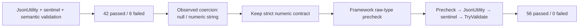

# TinySword SaveSystem：在 Human Review 下进行 AI-Assisted Engineering

> **Case Study Question**
> How was the TinySword SaveSystem redesigned with Codex while retaining human engineering control?

## 1. Case Study Overview

TinySword 原有存档是由 `GameManger` 直接读写的 CSV 文本。此次改造将它收敛为一个小型、版本化的 JSON SaveSystem，并明确区分 New Game 与 Continue：New Game 不读取已有存档，清除 pending restore、恢复 persistent coin 的初始值，并通过重新加载 `GameScene` 重建 scene-owned runtime state；Continue 先完成读取与完整 Validation，再加载场景并一次恢复 Player position 与 coin。

最终结果不是一次性接受 AI 生成的方案，而是一个受控工程闭环：Codex 先做只读 Architecture Analysis，Developer 通过 Human Review 缩减 Scope，明确批准后才实施；第一轮 Unity Edit Mode Tests 以 `42 passed / 6 failed` 推翻了实现中的一个假设，随后采用更窄的修正，最终由 Developer 在 Unity 中报告 `56 passed / 0 failed`、targeted Play Mode validation 全部 PASS，PR 已合并。

```mermaid
flowchart LR
    Problem["Legacy save risks"] --> ReadOnly["Codex read-only analysis"]
    ReadOnly --> Review["Human Review"]
    Review --> Approval["Explicit implementation approval"]
    Approval --> Implementation["Scoped implementation"]
    Implementation --> Tests["Unity validation"]
    Tests -->|evidence contradicts assumption| Revision["Minimal architecture revision"]
    Revision --> Revalidation["Edit Mode + Play Mode revalidation"]
    Revalidation --> Merge["Developer merge decision"]
```



核心主题是：**AI-assisted engineering with human review and empirical validation**。

## 2. Starting Point

改造前，正式存档路径是 `Application.persistentDataPath/save.txt`，内容为：

```text
x,y,z,coin
```

Save 从 `Player` 位置和 `GameManger.coinNum` 取得数据，再直接调用 `File.WriteAllText`。Continue 则先加载 `GameScene`，随后由 `Update` polling 触发 `DoLoad()`，读取文本、`Split(',')`、逐项 `Parse`，并直接修改运行时状态。

这个流程的主要风险是：

- 没有格式版本，无法明确拒绝不受支持的数据。
- Validation 较弱，缺失、损坏或非法字段可能在运行时才暴露。
- 解析和状态写入交错，可能只恢复 position、未恢复 coin，形成 partial restore。
- 浮点文本与逗号分隔依赖当前 Culture，格式可能产生歧义。
- `GameManger` 使用 `DontDestroyOnLoad`，New Game 未明确重置 coin，可能继承上一局状态。
- Continue 在验证存档之前就加载 `GameScene`，失败发生得太晚。
- `SettingCanvas` 在调用 Save 后直接显示成功提示，写盘失败时可能误报成功。

这些起点事实来自 SaveSystem 开发历史；当前仓库用于核对改造后的实现，而不是反向推断旧代码。

## 3. Codex Read-only Architecture Analysis

开发没有从修改代码开始。根据 SaveSystem Codex Thread，Codex 首先只读检查了：

- `GameManger` 的 Singleton、Scene transition、coin 与旧 Save/Load 流程；
- `Player` 的生命周期，以及 `Player.Instance` 的注册时机；
- Start / Game Scene 行为和相关 Prefab / Scene serialized values；
- 现有 GameState integration 与 Scene load reset；
- `SettingCanvas` 的保存成功提示；
- 现有 assembly 与测试边界。

在这一阶段，Codex 没有代码修改权限。它提出的 Architecture Proposal 将职责划分为：

| Boundary | Proposed responsibility |
| --- | --- |
| `SaveData` | versioned V1 DTO |
| `SaveJsonCodec` | JSON serialization、deserialization 与 Validation |
| `SaveFileStore` | 文件读写与 I/O failure boundary |
| `GameManger` | New Game、Continue、snapshot、Scene lifecycle 与 restore orchestration |

Proposal 同时提出使用 `JsonUtility`、fresh sentinel candidate、`sceneLoaded` restore、在 owner 首次 `Awake` 捕获 `initialCoinNum`，并将正式文件改为 `save.json`。它还分析了 stricter JSON structure checking、temporary / replace write、Player handshake 与 polling 等设计选择。

## 4. Human Review Changed the Proposal

Developer 没有简单批准完整 Proposal，而是逐项决定哪些复杂度适合 TinySword 当前 V1。

| Proposal / option | Human Review decision | Reason |
| --- | --- | --- |
| 额外的 Raw JSON structure checker | 初次实施时删除 | 若继续自行维护 grammar、duplicate key 和 token-level validation，会让当前五字段 V1 承担接近 custom parser 的复杂度。 |
| strict unknown-field rejection | 简化为允许 unknown fields | V1 只需保证 required fields 完整合法 |
| duplicate-key handling | 不纳入 V1 | 不为当前格式建立额外 parser 行为 |
| temporary / atomic-ish write | 拒绝 | 会扩展到 power-loss、replace semantics 与 recovery；本 PR 不声称 crash-safe 或 atomic |
| Player handshake | 不采用 | 当前 Player 是同步启用的 Scene object；修改 Player 会增加 coupling |
| pending restore 的 Update polling | 不采用 | 当前生命周期允许更明确的一次性 `sceneLoaded` 检查 |

这些技术并非在所有项目中都错误；结论只针对 TinySword 当时的五字段 Save V1 和已确认生命周期。

Human Review 保留了 DTO / Codec / FileStore separation、`sceneLoaded` integration、`initialCoinNum` snapshot、明确的 New Game / Continue semantics，以及 `SettingCanvas` 对保存结果的处理。Developer 实际控制的是 architecture scope，而不只是对 Codex 输出做形式批准。

## 5. Explicit Implementation Boundary

Codex 只有在 Developer 明确批准修订版 Scope 后，才进入 implementation。

允许修改：

- `Assets/Scripts/GameManger.cs`
- `Assets/Scripts/SettingCanvas.cs`

允许新增：

- `Assets/Scripts/SaveSystem/` 下的 `SaveData`、`SaveJsonCodec`、`SaveFileStore` 与 asmdef；
- `Assets/Tests/EditMode/SaveSystem/` 下的 Codec、FileStore tests 与 test asmdef。

明确不修改：

- `Player`；
- Scene、Prefab；
- GameState implementation；
- Packages；
- existing `.meta` / GUID；
- unrelated systems。

这个边界同时控制了 Unity Serialization 和 Lifecycle risk：不迁移现有业务脚本的 assembly，不改变 serialized reference，不改 Player 初始化协议，不把 Save V1 扩展成其他运行时系统的持久化方案。

## 6. First Implementation

第一次实施建立了四个清晰边界：

- `SaveData` 保存 `version`、三轴 position 和 `coinNum`。
- `SaveJsonCodec` 使用 `JsonUtility`、fresh sentinel candidate 和 `TryValidate()`。
- `SaveFileStore` 使用 UTF-8 直接读写 `save.json`，并把预期 I/O exception 转换为失败结果。
- `GameManger` 负责 snapshot、New Game reset、Continue 预验证、pending data 和 `sceneLoaded` restore。

`SettingCanvas` 改为仅在 `TrySaveGame()` 返回成功时显示现有成功提示；原有 `SaveGame()` public entry point 被保留为 compatibility adapter。新增 Edit Mode tests 与独立 asmdef，使 Codec 和 FileStore 可以在不加载 Gameplay Scene 的情况下回归验证。

```mermaid
flowchart TB
    subgraph Save["Save"]
        UI["SettingCanvas"] --> GM1["GameManger"]
        GM1 --> Snapshot["SaveData snapshot"]
        Snapshot --> Codec1["SaveJsonCodec validate + serialize"]
        Codec1 --> Store1["SaveFileStore"]
        Store1 --> File["save.json"]
    end

    subgraph Continue["Continue"]
        Start["StartScene"] --> Store2["read save.json"]
        Store2 --> Codec2["deserialize + complete validation"]
        Codec2 -->|valid| Pending["pendingSave"]
        Codec2 -->|invalid| Stay["remain in StartScene"]
        Pending --> Load["load GameScene"]
        Load --> Event["sceneLoaded"]
        Event --> Ready["verify Scene + Player readiness"]
        Ready --> Restore["restore position + coin"]
    end
```



New Game 则清除 pending data，将 coin 恢复到 owner 在首次 `Awake` 捕获的 `initialCoinNum`，再加载 `GameScene`；Player 出生位置继续由 Scene 配置决定。Legacy `save.txt` 不读取、不迁移，也不删除。

## 7. The Important Failure: 42 Passed / 6 Failed

第一次真实 Unity Integration Validation 的结果是：

```text
Unity compile: PASS
SaveSystem Edit Mode Tests: 42 passed / 6 failed
Console: no new errors
```

现有历史明确记录的失败案例只有：

- `positionX: null`
- `coinNum: "10"`

Trailing garbage test 当时已经 PASS。其余四个失败测试的名称没有可靠记录，因此本文不补全或猜测。

第一次实现隐含的假设是：`JsonUtility` 遇到错误 primitive type 后，要么保留非法 sentinel，要么产生能被 semantic Validation 拒绝的值。但 Unity Test Runner 证明，`JsonUtility` 会对部分错误 primitive type 做宽松 coercion。

fresh sentinel 仍能识别 missing field，因为缺失字段不会覆盖 sentinel；它却无法区分：

```text
raw JSON number
```

与：

```text
null / numeric string
    ↓ JsonUtility coercion
合法的 C# 数值
```

因此，这不是测试过严或字符串特例，而是生产 Validation contract 与真实 serializer behavior 之间的缺口。

## 8. Human Decision After Test Failure

Developer 没有删除失败测试，也没有把 contract 放宽为接受：

```text
null → 0
"10" → 10
```

Human Review 明确决定：Save V1 的 required numeric fields 在原始 JSON 中必须确实是 JSON `number`。

同时，修正范围继续排除 custom parser、Regex tokenizer、third-party JSON package 和 unrelated architecture expansion。获批的变化更窄：使用 framework JSON reader，在 `JsonUtility` 之前进行 V1 raw structure / type precheck；`JsonUtility`、fresh sentinel 和 `TryValidate()` 继续保留。

这一步体现了 Human Review 的双向控制：既没有为了维持初版设计而降低 correctness contract，也没有因为测试失败就批准一套通用 JSON 基础设施。

## 9. Minimal Architecture Correction

最终增加了 `System.Runtime.Serialization.Json.JsonReaderWriterFactory`。它负责解析 raw JSON，`SaveJsonCodec` 只施加 Save V1 所需的有限规则：

- root 必须是 object；
- 五个 required fields 必须存在；
- required fields 的 raw JSON type 必须是 `number`；
- `version` 与 `coinNum` 必须以 `InvariantCulture` 满足 Int32 语义；
- position 必须可解析为 finite float；
- root object 后不得存在 trailing content；
- unknown fields 仍可忽略。

通过 precheck 后，流程仍然进入 `JsonUtility.FromJsonOverwrite`，使用新的 sentinel candidate，最后执行 semantic `TryValidate()`，检查 supported version、non-negative coin 与 finite coordinates。



这是由测试证据触发的 Architecture Revision，不是事后把最终实现描述成最初就已确定的方案。

## 10. Second Validation

第二轮结果为：

```text
Unity compile: PASS
SaveSystem Edit Mode Tests: 56 passed / 0 failed
Console: no new error
```

这组结果的证据来源是 Developer 在 ChatGPT SaveSystem Development History 中提交的 Unity 运行结果。SaveSystem Codex Thread 自己只完成了源码修订、独立编译与静态检查，并明确说明没有运行真实 Unity Test Runner；因此不能写成“Codex Thread confirmed final Unity validation passed”。

## 11. Runtime Validation

数据层通过后，Developer 按 targeted checklist 进行 Play Mode validation，并报告以下范围全部 PASS：

- New Game baseline 与 runtime coin reset；
- Save → Continue 的 position 与 coin restore；
- 存在旧存档时 New Game 仍忽略但保留存档；
- missing save、malformed JSON；
- unsupported、missing 或 wrong-type data；
- legacy `save.txt` ignored；
- repeated Continue；
- Restart semantics；
- Scene lifecycle 与 GameState reset compatibility；
- duplicate `GameManger` regression；
- save-success UI；
- Console regression。

准确表述是：**Developer-reported targeted Play Mode validation: PASS.** 历史中没有可用于本文的截图、精确运行时数值或完整日志，因此不进一步扩写。

ChatGPT history 最终记录 SaveSystem PR 已合并。本文不提供 PR number、commit hash 或 merge hash，因为现有证据没有可靠给出这些标识。

## 12. Developer vs Codex Responsibility

| Codex contribution | Developer responsibility |
| --- | --- |
| repository inspection | problem definition 与验收目标 |
| read-only Architecture Proposal | Scope 冻结与 architecture acceptance / rejection |
| 按批准边界实施 | explicit implementation permission |
| Edit Mode tests implementation | diff 与 Static Code Review |
| 基于失败测试修订实现 | 解释测试结果并决定 Validation contract |
| static analysis 与局部编译检查 | Unity compile、Edit Mode 与 Play Mode validation |
| 报告未验证项和剩余风险 | 最终 PR / merge decision |

仓库根目录的 `AGENTS.md` 提供了 project-level constraints：默认先分析、控制 Scope、保护 Unity serialized assets、区分静态检查与 Runtime validation，并禁止未经授权的 Git 写操作。它使 AI 行为可预测，但实际 architecture decision boundary 仍然是 Human Review 与 Developer 的 explicit approval。

## 13. What This Case Demonstrates

这个案例能够证明的不是某个效率百分比，而是一套可审查的协作方式：

- AI coding agent 可以先建立 repository-grounded model，再提出与项目规模匹配的 Architecture Proposal。
- Proposal 需要被审阅、删减和冻结，而不是因为结构完整就直接实施。
- 独立 Scope 让实现、回归和 Review 保持可控。
- 自动化测试不仅验证代码，也可以挑战 AI 与 Human Review 共同接受过的假设。
- Unity Runtime validation 补足静态分析无法证明的 Scene、Player readiness、UI 和 lifecycle behavior。
- 最终 Validation contract、Runtime acceptance 与 merge decision 仍由 Developer 所有。

最关键的事实是：

> The first implementation was not accepted because it looked reasonable; Unity tests disproved one of its assumptions.

随后采取的修正也没有扩大成全面重构，而是针对已观察到的 serializer boundary 建立最小、可测试的防线。

## 14. Evidence and Limitations

本文严格区分三类证据：

| Evidence source | Used to establish | Not used to claim |
| --- | --- | --- |
| **A. Current Repository** | 最终 `SaveData`、`SaveJsonCodec`、`SaveFileStore`、`GameManger` / `SettingCanvas` integration、tests、asmdef，以及 `docs/architecture.md` 和 `AGENTS.md` 中的当前边界 | 旧实现的逐行行为、历史决策的时间顺序、谁执行了最终 Unity 验证 |
| **B. SaveSystem Codex Thread Historical Report** | 初始只读检查、Architecture Proposal、Human-approved implementation scope、Codex 实施与测试追加、42/6 后的 strict precheck 修订，以及 Codex 明确未执行最终 Unity Test Runner | 最终 56/56 或 Play Mode PASS |
| **C. ChatGPT SaveSystem Development History** | Human Architecture Review、scope reduction、Static Code Review、42/6 与 coercion root cause、第二轮修订、Developer-reported 56/56、targeted Play Mode PASS、PR merged | 未记录的 Git 标识、失败测试名称、截图或运行时测量值 |

当前证据能够确认：

- 第一轮 `42 passed / 6 failed`；
- `positionX: null` 与 `coinNum: "10"` 两个明确错误类型案例；
- 基于 `JsonReaderWriterFactory` 的 strict precheck correction；
- Developer-reported `56 passed / 0 failed`；
- Developer-reported targeted Play Mode PASS；
- SaveSystem PR 已合并。

本文有意不声称或补写：

- PR number、commit hash、merge hash；
- 六个失败测试的完整名单；
- 精确运行时截图、坐标、coin 数值或日志；
- performance gain；
- crash-safe / atomic write；
- complete world-state persistence；
- every-platform validation。

这些限制不是案例的缺口修饰，而是证据边界的一部分。SaveSystem 的可信结论来自可追溯的 Review、失败、修订与验证，而不是从最终代码反向构造一条无摩擦的成功叙事。
