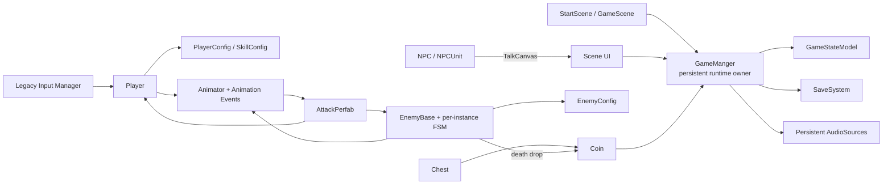
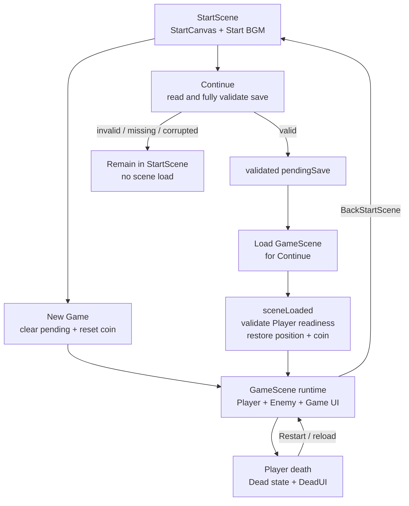
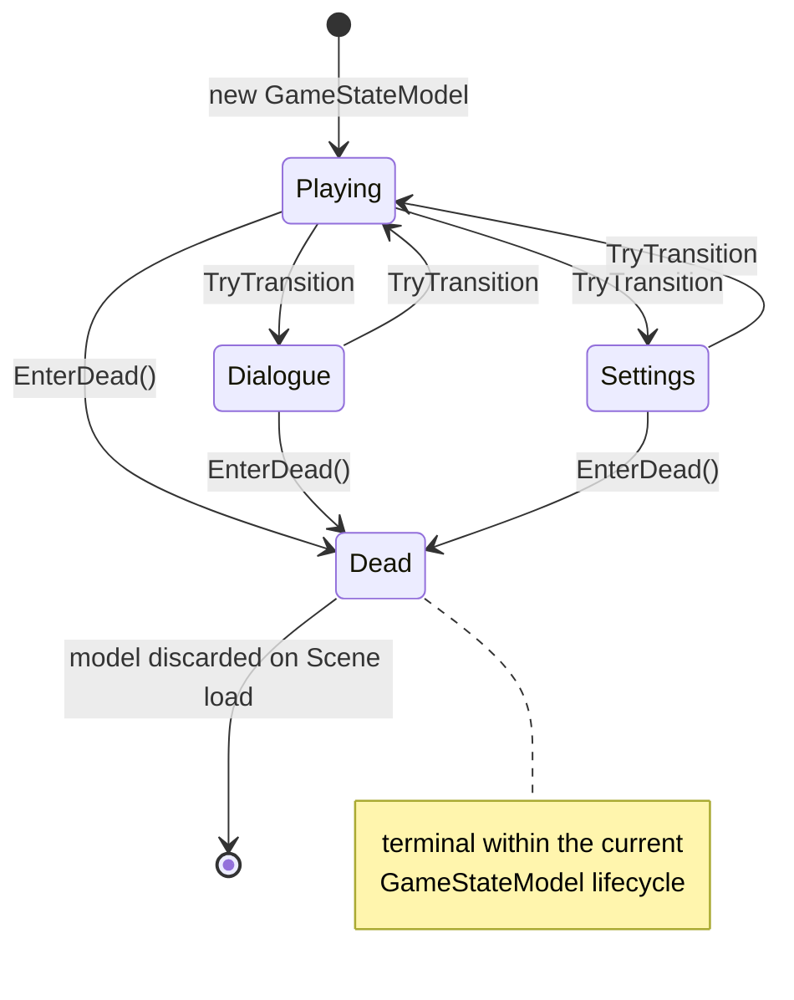
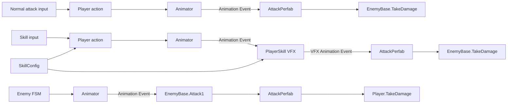
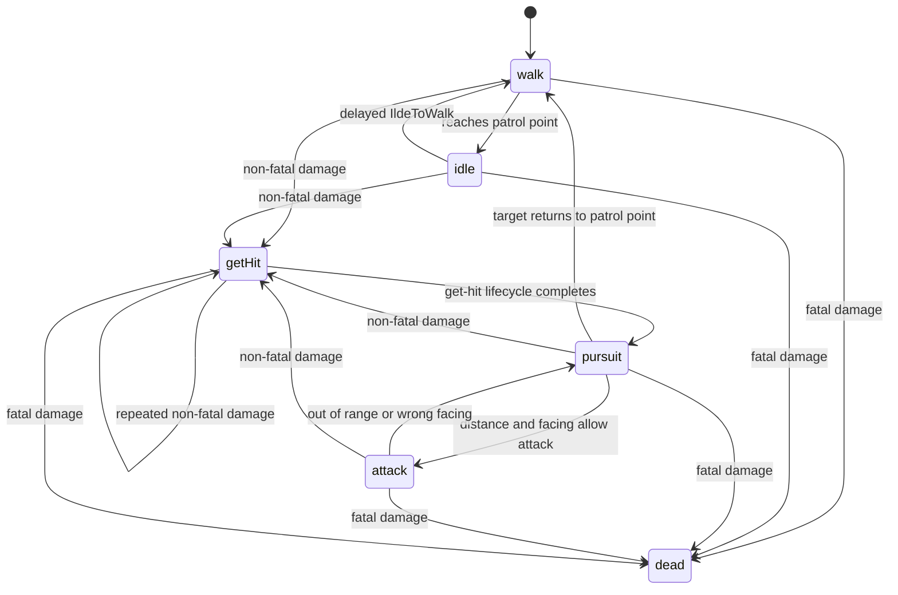
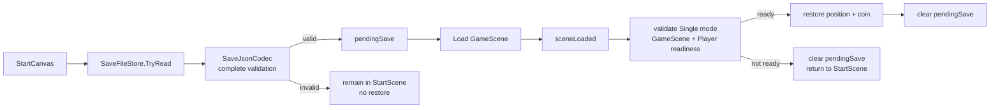

# TinySword Architecture

本文档描述 TinySword 当前已经存在并进入正式项目的架构。它面向 Unity / C# 开发者、技术面试官和作品集 reviewer，重点说明系统边界、依赖方向与运行时生命周期，而不是逐个类或方法提供 API Reference。

## 1. Architecture Overview

TinySword 是使用 Unity `6000.0.47f1` 制作的 2D top-down ARPG。项目使用 uGUI 构建界面，通过 Legacy Input Manager 接收玩家输入。

当前架构由以下几类部分组成：

- persistent application/runtime services：由 `GameManger` 统一承担场景切换、全局状态、金币、音频和存档集成；
- scene-owned gameplay objects：Player、Enemy、UI、NPC、Chest 等随 Scene 创建和销毁；
- data-driven configuration：`PlayerConfig`、`SkillConfig`、`EnemyConfig` 以 ScriptableObject 提供共享调参数据；
- combat runtime：Player、Enemy、Animator、Animation Event、技能 VFX 与 `AttackPerfab` 共同组成伤害链路；
- Enemy FSM：每个 Enemy 实例拥有独立状态机和状态对象；
- persistence：Save DTO、JSON codec、文件存储和 Scene restore 各自保持明确边界；
- UI integration：UI 负责显示和用户命令，GameState 负责 Player operation permission。



`GameManger` 是跨 Scene 的运行时入口，但并不吸收所有职责：Player 和 Enemy 仍拥有各自 gameplay state，UI 仍拥有显示状态，Config 只提供共享数据，SaveSystem 的 codec 与文件层也保持独立。

## 2. Runtime Composition and Scene Lifecycle

### StartScene

`StartScene` 是主入口，主要包含：

- `StartCanvas`：提供 New Game、Continue、Exit 命令；
- `GameManger` Prefab 实例：尝试建立 persistent Singleton；
- Start BGM：`StartCanvas.Start` 选择菜单音乐。

New Game 调用 `GameManger.StartGame()`。该路径清除 pending save、把金币恢复为 Singleton 初始化时记录的初始值，然后加载 `GameScene`。

Continue 调用 `GameManger.loadSaveGame()`。存档必须先完成文件读取和完整 validation，验证成功的数据才会进入 `pendingSave`，随后才加载 `GameScene`。

### GameScene

`GameScene` 主要拥有：

- 一个 scene-owned Player；
- Enemy runtime instances；
- Normal、Skill、Settings、Dialogue 和 Dead UI；
- NPC、Chest，以及由 Chest 或 Enemy death 生成的 Coin；
- 一个与 StartScene 同源的 `GameManger` Prefab 实例。

`GameManger` 使用 `DontDestroyOnLoad` 和 Singleton guard。两个 Scene 都序列化了该 Prefab，因此实际运行时由第一个合法实例保留；后续 Scene 创建的重复实例会在 `Awake` 中销毁。从 StartScene 进入时沿用 persistent instance；直接载入 GameScene 时，该 Scene 的实例可以成为 Singleton。

Player、Enemy、UI、NPC 和 Chest 都属于 Scene lifecycle。Scene reload 会重建它们的运行时状态。Config ScriptableObject 是共享项目资产，不随 Scene 重新创建，并在当前设计中作为 runtime read-only tuning source 使用。



每次 Scene load 时，persistent `GameManger` 都会创建新的 `GameStateModel`，使新 Scene 从 `Playing` 开始。Continue 是例外数据路径，但不是例外状态路径：GameState 仍先重建为 Playing，之后再消费经过验证的 pending data。

Dead Restart 直接 reload `GameScene`。Player、Enemy、Chest 和 UI 状态会重建，persistent coin 不会因此自动重置；只有 New Game 路径显式恢复初始金币。

## 3. GameState Architecture

当前 `GameState` 包含四个值：

- `Playing`
- `Dialogue`
- `Settings`
- `Dead`

权威状态关系为：

```text
GameManger
  owns
GameStateModel
```

`GameManger.CurrentState` 和 `GameManger.CanAcceptPlayerInput` 是对该模型的读取入口。`GameStateModel` 不控制 Canvas 显隐，不修改 `Time.timeScale`，也不停止 Enemy、物理或其他 Scene 行为。它当前最重要的职责是为 Player operation permission 提供统一判断。



普通 `TryTransition(expectedState, nextState)` 只允许：

- `Playing → Dialogue`
- `Dialogue → Playing`
- `Playing → Settings`
- `Settings → Playing`

调用方提供的 `expectedState` 必须与当前状态匹配。Same-state transition、`Dialogue ↔ Settings` 和所有普通 Dead transition 都会被拒绝。因此 Dialogue 与 Settings 互斥，且 `Playing → Dead` 不是 `TryTransition` 的能力。

Dead 只能通过 `EnterDead()` 建立。它可从 Playing、Dialogue 或 Settings 进入，并在当前模型生命周期中保持 terminal。Scene load 丢弃旧模型并创建新的 `GameStateModel`，由新模型恢复 Playing；这不是一次 `Dead → Playing` 的普通状态转换。

Player 的实际输入条件还要求其 Config 完整、本地 `isDead` 为 false，并且 `GameManger.Instance` 可用。Settings 或 Dialogue 打开时，Player 停止接收新操作并停止移动，但 cooldown timer 和 Enemy 行为仍按正常时间推进。

## 4. Player and Combat Architecture

`Player` 聚合当前角色所需的输入、移动、普通攻击、Combo、Guard、技能、cooldown、Animator、HP、damage、death 和 Player UI 集成。伤害并不是在输入处理时直接结算，而是通过动画时序生成短生命周期的攻击判定体。



### Normal Attack

Legacy Input Manager 的 `J` 输入进入 `Player.PlayerAttack()`。Player 在两段 Combo 间切换并触发 Animator 的 `Attack1` 或 `Attack2`。两个攻击动画都通过 Animation Event 调用 `Player.Attack1()`，由该 receiver 在攻击点生成 `AttackPerfab`，注入来自 `PlayerConfig` 的攻击伤害、player faction 和 attacker Transform。Trigger 命中 Enemy 后调用 `EnemyBase.TakeDamage()`。

### Skill

技能输入先由 Player 检查 operation permission、行动状态和 cooldown。Player 选择对应 `SkillConfig`，触发统一的 `Skill` Animator trigger；Player 动画的 Animation Event 再按当前 `skillNum` 生成对应 `PlayerSkill` VFX。

VFX 由 Player 注入 `SkillConfig` 与 attacker Transform。VFX 自身的 Animation Event 调用 `PlayerSkill.Skill1/2/3()`，最终使用 Config 中的 damage 和 attack scale 创建 `AttackPerfab`。Cooldown、action recovery 和 sound index 同样来自对应 `SkillConfig`。

### Enemy Attack

Enemy attack state 根据距离、朝向和 cooldown 触发 Animator。攻击动画通过 Animation Event 调用 `EnemyBase.Attack1()`，按朝向选择生成位置，并把 `EnemyConfig.AttackDamage`、enemy faction 和 attacker Transform 注入 `AttackPerfab`。Trigger 命中 Player 后调用 `Player.TakeDamage()`，由 Player 处理 Guard、HP、受击和死亡。

`AttackPerfab` 是 runtime damage payload boundary：faction、damage 和 attacker 都在生成时通过 `Init` 注入，它不读取任何 ScriptableObject Config。Animation Event 是正式 Gameplay 调用链的一部分；具体动画资产可以包含其自身数量和时点的事件，架构不假设所有攻击动画只生成一次 hitbox。

## 5. Data-driven Configuration

当前项目使用三类 ScriptableObject 分离共享调参数据与实例运行时状态：

| Configuration | Shared configuration data | Runtime consumer |
| --- | --- | --- |
| `PlayerConfig` | movement speed、normal attack damage、max health、guard cooldown | `Player` |
| `SkillConfig` | cooldown、skill damage、attack scale、action recovery、sound index | `Player`、运行时生成的 `PlayerSkill` |
| `EnemyConfig` | movement speed、attack damage、max health、attack distance、attack cooldown | `EnemyBase` 与 concrete enemy states |

仓库当前包含一个 Player config、三个 Skill config，以及 Enemy1、Enemy2、Enemy3 和 Boss 对应的 Enemy config。不同 Prefab Variant 可以引用不同 Config，但 Config 不持有任何具体敌人的运行时状态。

以下数据属于 runtime mutable state：

- Player current HP、movement/input、Combo、Guard、death state；
- skill cooldown progress、availability 和当前技能选择；
- Enemy current HP、current/previous FSM state、attack/get-hit timer；
- Enemy target、attacker 和 movement state。

这些状态由各 MonoBehaviour 实例持有，Scene reload 时随实例重建。ScriptableObject 在当前架构中只作为共享、只读的 tuning source，不承担 session state。

Player 中的 `speed`、`ATK`、`HPMax` 和 `skill*CD` 等 compatibility getter 只是对 Config 数据的读取代理，不构成第二套配置来源。

Serialized reference 分为两层：Player 的核心 Config reference 和普通攻击 Prefab 已绑定在 Player Prefab 中；HP/Dead UI、skill VFX 和 spawn point 等 scene-bound reference 则由 GameScene 的 Player instance override 提供。当前主技能链使用运行时生成的 skill VFX。

## 6. Enemy FSM Architecture

Enemy FSM 分为两个层次：

- `EnemyStateMachine`、`EnemyState` 和 `IEnemyStateBehaviour` 构成纯 C# Core；
- `EnemyBase` 与六个 concrete state behaviour 把 Core 接入 Transform、Rigidbody2D、Animator、Config、Trigger、damage 和 drop。

六个状态为：`idle`、`walk`、`pursuit`、`attack`、`getHit`、`dead`。

每个 Enemy runtime instance 都拥有独立的 `EnemyStateMachine`、独立的六个 state objects，以及独立 HP、timer、target 和 attacker state。多个实例可以共享同一个 `EnemyConfig` asset，但不会共享 mutable runtime state。

状态生命周期为：

```text
Initialize(initialState)
  → ownership initialization
  → Enter(previousState)

EnemyBase.Update()
  → current state Tick()

ChangeState(nextState)
  → current state Exit()
  → CurrentState / PreviousState ownership update
  → next state Enter(previousState)
```

Same-state `ChangeState` 不是 no-op，而是完整执行 Exit 和 Enter。这允许重复受击重新建立 `getHit` 生命周期，也意味着文档和测试不能把重复状态请求解释为自动忽略。

下图有意突出 state behaviour 内部条件以及 damage/combat 产生的主要 **current gameplay transitions**。Pursuit Trigger 等外部事件入口在图后单独说明，因此该图既不穷举所有运行时转换边，也不是完整的 transition whitelist：



`EnemyStateMachine` Core 只管理已注册 behaviour、状态所有权和生命周期调用，并不限制任意两个已注册状态之间的转换。图中的边来自当前 concrete state 的内部条件和 combat flow；外部入口还可以触发图中未画出的转换。

`PlayerEnterPursuitBox` 会让任意非 Dead 状态进入 Pursuit；`PlayerExitPursuitBox` 在 Attack 中使用延迟返回 Walk，在其他非 Dead 状态中立即把巡逻目标设回 `pos1` 并进入 Walk。由于 same-state change 会完整重入，重复进入 Pursuit 或在 Walk 中收到退出事件同样会执行状态生命周期。

Idle 从 Walk 进入时通过 `Invoke` 安排两秒后的 `IldeToWalk`；离开 Idle 时取消该回调。Player 在 Attack 状态离开追击区时，按剩余 attack cooldown 安排 `AttackToWalk`；Attack Exit 会取消该回调。Dead Enter 安排延迟销毁、移除 HP UI，并在最终销毁 Enemy root 前生成 Coin。这里的 Exit cleanup 防止状态已经改变后仍执行上一状态的延迟回调。

## 7. SaveSystem Architecture

SaveSystem 由四个清晰边界组成：

| Boundary | Responsibility |
| --- | --- |
| `SaveData` | versioned save DTO |
| `SaveJsonCodec` | JSON structure、field type、version 和 value validation；serialization/deserialization |
| `SaveFileStore` | UTF-8 file read/write 和文件异常边界 |
| `GameManger` integration | Player readiness、Scene lifecycle、snapshot capture 和 pending restore |

当前正式存档为 `Application.persistentDataPath/save.json`，格式是 UTF-8 JSON，版本为 `1`。保存内容只有 Player 的三维位置和全局 coin count。

### Save

`SettingCanvas` 把 Save 命令交给 `GameManger`。`GameManger` 只在 active GameScene 中存在 active/enabled Player 且没有 pending restore 时捕获 snapshot。`SaveJsonCodec` 在文件写入前验证 DTO；非法 snapshot 不会覆盖已有文件。

```text
SettingCanvas
  → GameManger
  → SaveData snapshot
  → SaveJsonCodec validation / serialization
  → SaveFileStore
  → save.json
```

### Continue



`SaveJsonCodec` 要求 V1 顶层 object 完整包含 `version`、`positionX`、`positionY`、`positionZ` 和 `coinNum`，并验证 number type、受支持版本、非负金币和 finite coordinates。只有完整读取并验证成功的数据才会写入 `pendingSave`。

Scene load 后，`GameManger` 再验证 Single load mode、目标 Scene 和 Player readiness。所有 readiness 检查通过后才恢复 Player position 与 coin count，然后消费 pending data。Invalid、corrupted、unsupported save 或 Player readiness failure 都不会造成 partial restore。

Legacy `save.txt` 被忽略：它不会被迁移，不作为 fallback，也不会被删除。当前正式读写路径只处理 `save.json`。

## 8. UI and World Integration

UI display responsibility 与 gameplay state / permission responsibility 相互分离：

- `StartCanvas` 将 New Game、Continue 和 Exit 委托给 `GameManger`；
- `NormalCanvas` 选择 Game BGM，并在成功申请 `Playing → Settings` 后显示设置界面；
- `SettingCanvas` 管理设置显示、音量、Save 和返回 StartScene，关闭时申请 `Settings → Playing`；
- `TalkCanvas` 管理对话内容、角色图片和推进，在开始/结束时申请 Dialogue 状态转换；
- `DeadUI` 提供 GameScene reload；Dead 状态由 Player death flow 建立；
- `CanvasManger` 保存 scene UI reference、控制指定面板显示并更新 coin text，但不拥有 GameState；
- `SkillButton` 读取 Player runtime cooldown state，只负责显示；
- `NPCUnit` 通过 Physics2D Trigger 请求 TalkCanvas 开始或结束对话；
- `Chest` 持有 scene-local `isOpened`，首次触发时生成 Coin；
- `Coin` 被 Player 拾取后，通过 `GameManger` 增加全局金币并播放 SFX。

Settings 和 Dialogue 通过 GameState transition 申请 Player operation lock。Canvas 是否可见仍由对应 UI component 决定；GameStateModel 不反向驱动全部 UI，也不拥有对话内容、设置 Slider 或死亡画面。

## 9. Audio Architecture

`GameManger` 持有两个 persistent `AudioSource`：一个用于 SFX，一个用于 BGM，并序列化维护对应 AudioClip arrays。

- `StartCanvas.Start` 选择 StartScene BGM；
- `NormalCanvas.Start` 选择 GameScene BGM；
- Player normal attack、Guard、skills，Enemy attack 和 Coin pickup 通过 sound index 请求 `GameManger` 播放 SFX；
- `SettingCanvas` 读取并直接调整两个 persistent AudioSource 的 volume。

因为 AudioSource 属于 persistent `GameManger`，其 volume 在 Scene 切换后继续保留；进入新 Scene 时，由相应 UI component 选择该 Scene 的 BGM。

## 10. Validation Strategy

### Automated Edit Mode Tests

当前仓库包含 91 个展开后的 Edit Mode test cases，覆盖三个独立测试程序集：

- GameState：纯状态转换、input permission、expected-state guard 和 Dead semantics；
- SaveSystem：JSON serialization/validation、版本与数值边界、文化区域独立性、文件读写和 Legacy ignore；
- EnemyFSM：enum compatibility、Initialize/Tick/ChangeState 生命周期、same-state re-entry、实例隔离和失败边界。

本轮 Architecture Documentation 审计没有重新执行 Unity Test Runner，因此这里只确认当前仓库包含 91 个 Edit Mode test cases，不声明本轮测试通过结果。

### Targeted Unity Play Mode Validation

以下行为依赖 Unity runtime，仍由 targeted Play Mode manual validation 负责：

- Scene load、Singleton 和 `DontDestroyOnLoad` lifecycle；
- Animator transition 与 Animation Event receiver；
- Physics2D trigger、hitbox、Guard 和 damage；
- Player input 与 operation lock；
- Enemy pursuit trigger、concrete state behavior 和 delayed Invoke；
- Prefab / Scene serialized references 与 instance override；
- Save / Continue / pending restore 的 Scene integration；
- UI 显隐、按钮和 Slider；
- BGM、SFX 与 persistent volume。

### Pull Request Review

Pull Request Review 用于确认 architecture change 的实际范围、Serialized Reference 兼容性、Animation Event contract、Scene lifecycle，以及文档是否与当前代码和资产保持一致。自动化纯逻辑测试、Unity Play Mode 行为验证和人工 Review 共同构成当前项目的验证边界。

## 11. Architectural Boundaries

TinySword 当前保持小型、直接、增量式的架构。系统只在已经存在明确边界的地方进行分离，例如 GameState、Enemy FSM Core、Save codec/file store 和 ScriptableObject configuration。

当前项目没有为了抽象复杂度而引入 generic Ability System、general Event Bus、ECS 或 universal FSM framework。Player 和 Enemy concrete gameplay 仍以可直接追踪的 MonoBehaviour、Animator、Animation Event 和 Physics2D 调用链实现；这描述的是当前架构的规模与边界，而不是未来 Roadmap。
